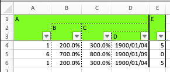

# df_to_xlsx_report

## Main components
* `df_to_xlsx_report.py`: Generic sample code to output DataFrame as a formatted Excel file
* `config.csv`: Config file specifying the format of the excel file.
    * `physical_name`: Column name of the DataFrame.
    * `logical_name`: String to display in the header on the Excel file.
    * `width`: Width of the column.
    * `left`: Line style of the left border of the column (see https://xlsxwriter.readthedocs.io/format.html#set_border). 
    * `level`: Column hierarchy.
    * `bg_color`: The background color of the header.
    * `num_format`: Format string of the column (See https://xlsxwriter.readthedocs.io/format.html#set_num_format)

When you run the sample code, you will get the following output.

## Features.
* It employs row-by-row data writing, hence the `constant_memory` option can be used. (Since OpenXLM (.xlsx) is a row-major data structure, writing data by rows can keep the memory usage constant even for large data.)
* `for (a, b) in zip(df['a'].to_list(), df['b'].to_list()):` is equivalent to and far faster than `for (a, b) in df[['a', 'b']].itertuples(index=False):`. Its generalized notation `for (a, b) in zip(*(df[col].to_list() for col in ['a', 'b']))` is employed in the code.

## To Be implemented
* Grouping by level
* Hiding empty columns
